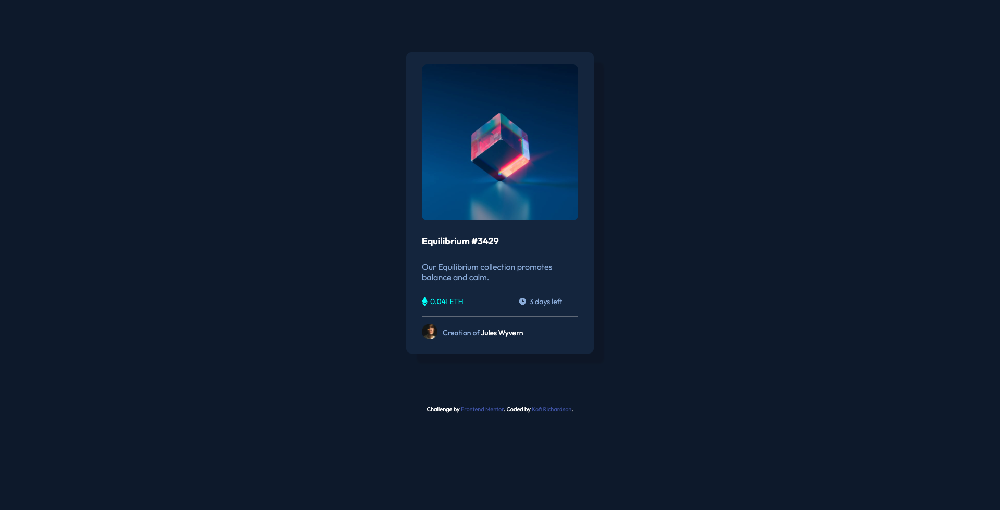
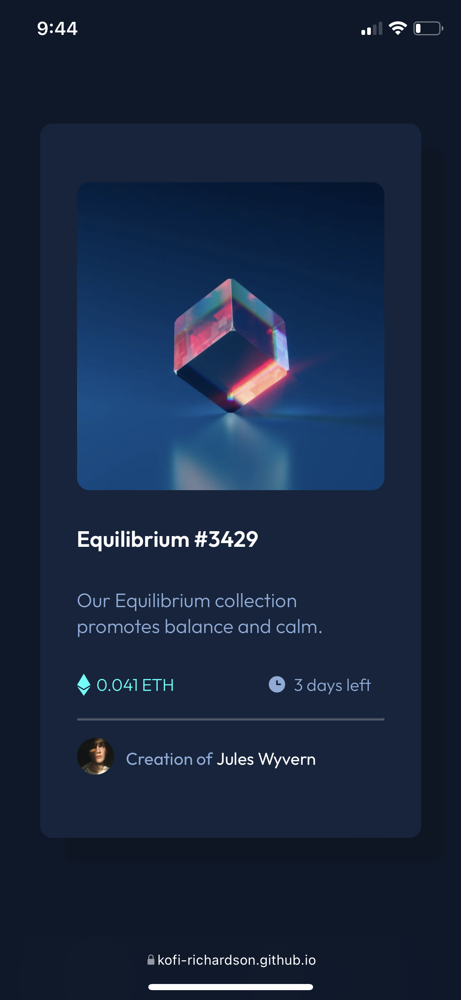

# Frontend Mentor - NFT preview card component solution

This is a solution to the [NFT preview card component challenge on Frontend Mentor](https://www.frontendmentor.io/challenges/nft-preview-card-component-SbdUL_w0U). Frontend Mentor challenges help you improve your coding skills by building realistic projects. 

## Table of contents

- [Overview](#overview)
  - [The challenge](#the-challenge)
  - [Screenshot](#screenshot)
  - [Links](#links)
  - [Built with](#built-with)
- [Author](#author)

## Overview

### The challenge

Users should be able to:

- View the optimal layout depending on their device's screen size
- See hover states for interactive elements

### Screenshot

### Links

- Solution URL: [Solution on GitHub](https://github.com/Kofi-Richardson/NFT-Preview-Card)
- Live Site URL: [Click to see website](https://kofi-richardson.github.io/NFT-Preview-Card/index.html)

## My process

### Built with

- Semantic HTML5 markup
- CSS custom properties
- Flexbox

## Author

- Website - [kofi Richardson](https://kofi-richardson.github.io/Resume/index.html)
- Frontend Mentor - [@Kofi-Richardson](https://www.frontendmentor.io/profile/Kofi-Richardson)
- Twitter - [@Richardson_paa](https://twitter.com/Richardson_paa)

